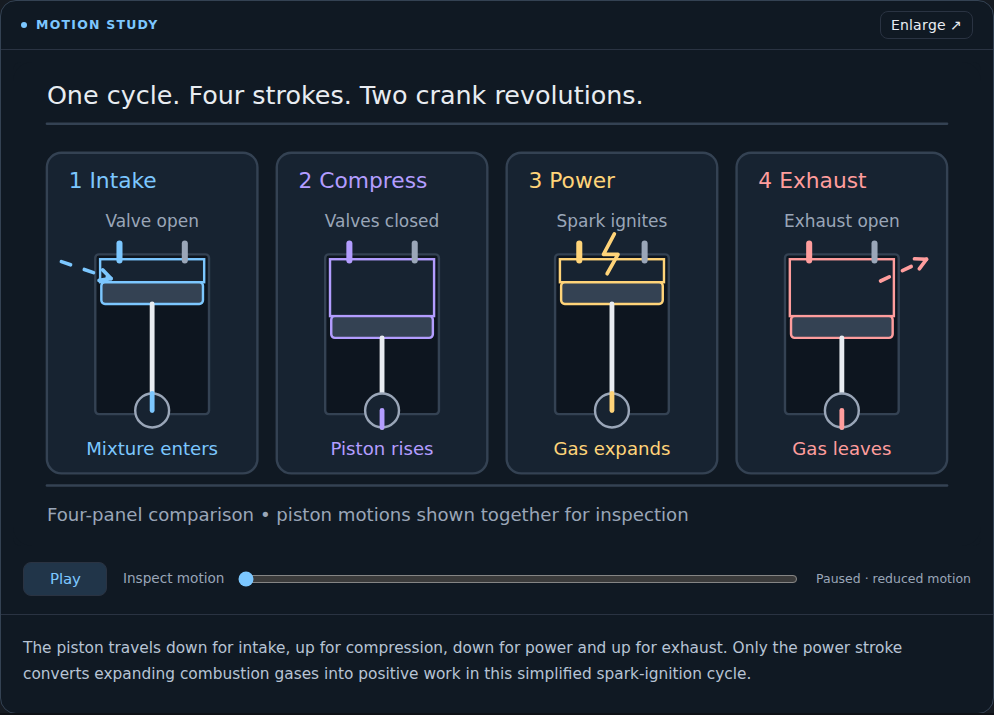
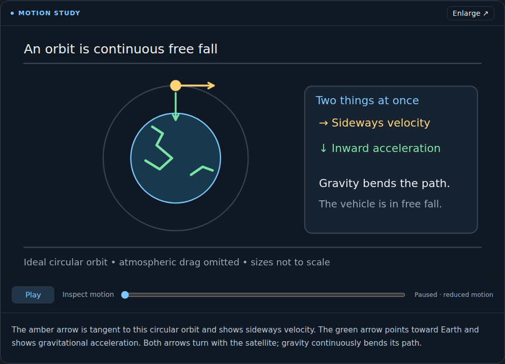
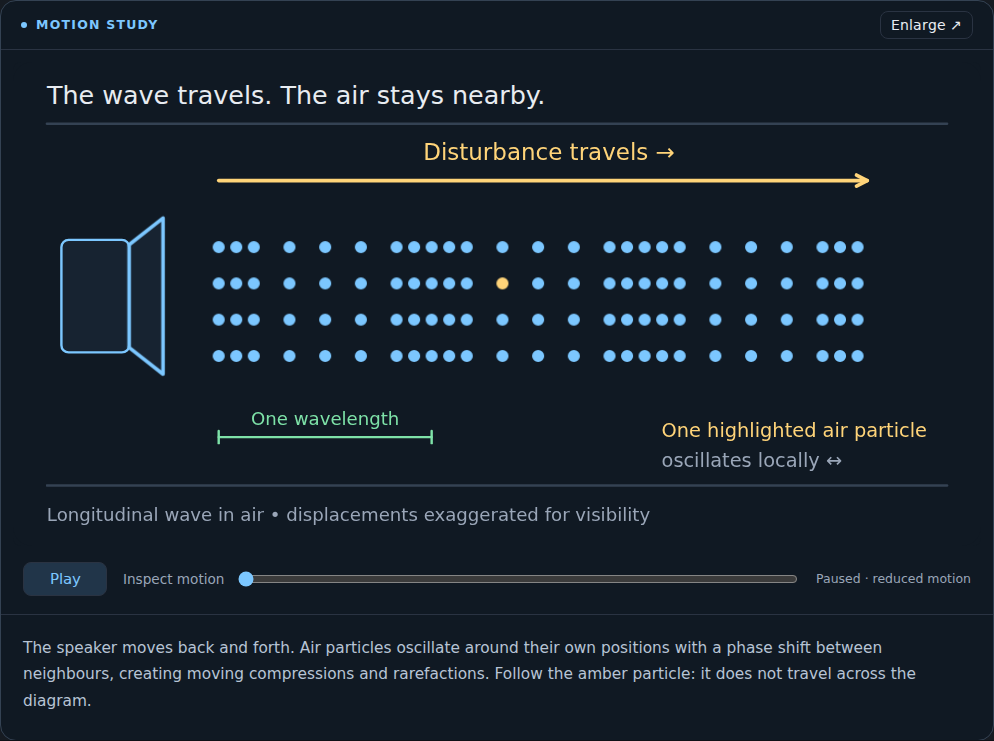

# Lesson illustration and motion pass

Reviewed the latest animated-diagram work at `1aa6bed`, then rebased this pass
onto `d62d277` to preserve the new Open course and Details library controls.

All 41 sections in the 12 included courses now have authored 800 × 400 SVGs.
Captions in Reading, Slides and visual flashcards match the actual drawings.
The course bodies, quizzes, sources and other learning content are preserved.
`scripts/author-illustrations.mjs` reproduces the drawings without generation.

## What changed

- Mechanisms replace abstract labels: connected piston/rod/crank geometry,
  correctly directed orbit vectors, oscillating sound particles, connected
  pulley ropes, explicit reactant counts and conditional-probability counts.
- Shared typography, spacing, colour roles and model-limit annotations.
- Each motion study has play/pause/replay and a keyboard-accessible timeline.
  Playback starts paused and runs one eight-second demonstration. Players freeze
  offscreen and in background tabs; view navigation disposes their clocks.
- A native modal enlarges the existing player, preserves progress, closes with
  Escape and restores focus. Static figures also offer enlargement.
- Flashcards use static drawings with their explanation and no nested controls.
- Imported SVG is constrained to basic shapes/text. Embedded CSS, SMIL and
  external-resource mechanisms are removed. Legacy artwork stays usable as
  static diagrams; text-only courses retain their existing fallback.
- Generated diagrams receive the same spacious mechanism-focused brief and
  cannot silently omit an approved section.

## Validation

The dependency-free Node suite passes **94 tests**. JavaScript syntax checks
and `git diff --check` pass.

Desktop Chromium at **1440 × 1100** passes `scripts/visual-acceptance.mjs`:

- All 41 included drawings appear in Reading and Slides; SVG text bounding
  boxes stay inside their viewBox and labels do not overlap other labels.
- Keyboard seeking changes engine geometry and leaves other figures alone.
  Pausing freezes exact progress; replay resets the clock.
- Reduced-motion startup, offscreen freezing, disposal on navigation, modal
  Escape/focus restoration and static visual flashcards pass.
- A quarter orbit rotates the satellite and both vectors together; air
  particles retain fixed equilibrium positions and bounded displacement.
- Screenshots of all 41 figures were inspected for composition and geometry.

The existing browser acceptance also passes the sample and all 12 included
courses in six views, library search/Details/opening, flashcard and quiz
interactions, notes failure/recovery/reload, imports/exports and the five-step
mocked generation pipeline. There are no uncaught page errors or live API calls.
CI runs both browser suites and uploads the figure screenshots and layout verdict.

These are explanatory models, not calibrated engineering simulations. The
engine drawing compares the four strokes in parallel; each panel depicts one
half crank turn. The orbit is an ideal circular orbit, and the range-circle
illustration explicitly uses a 2D analogy. Generated course accuracy and live
Gemini availability remain outside the browser checks.

## Examples

